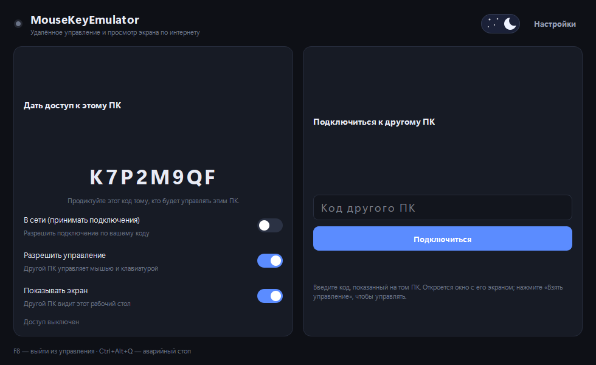
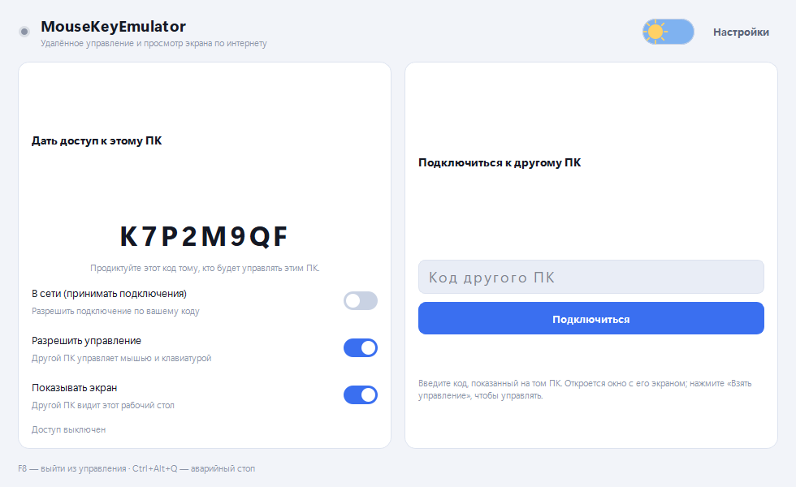
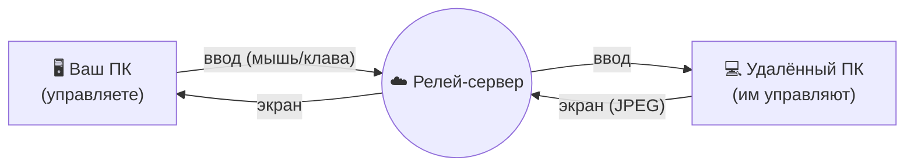

 

**Удалённое управление компьютером через интернет — экран + мышь и клавиатура.**

Подключайтесь к другому ПК по короткому коду: видите его экран и управляете
им мышью и клавиатурой. Работает через интернет (сквозь NAT) — как AnyDesk,
только своё и лёгкое.

 

[**⬇️ Скачать**](../../releases/latest) ·
[**🚀 Быстрый старт**](#-быстрый-старт) ·
[**🔌 Версия для ESP32**](#-версия-для-esp32)

---

## 🎯 Что это

**MouseKeyEmulator** — приложение для удалённого доступа к компьютеру по
интернету:

- 🖥️ **Экран** управляемого ПК транслируется вам в окно.
- 🖱️⌨️ **Мышь и клавиатура** — вы управляете удалённым ПК (движение как живой
  мышью, без «телепорта»).
- 🔗 **Подключение по коду** — у каждого ПК свой короткий код; ввёл код —
  подключился. Всё идёт через сервер-релей, поэтому работает сквозь NAT без
  проброса портов.

<table>
<tr>
<td width="50%"> 
<b>Тёмная тема</b>
</td>
<td width="50%"> 
<b>Светлая тема</b>
</td>
</tr>
</table>

---

## ⚙️ Как это устроено

- Оба ПК соединяются с релей-сервером по одному **коду комнаты**; сервер
  связывает их и передаёт данные в обе стороны.
- Управляемый ПК стримит экран (JPEG) и вводит приходящие мышь/клавиатуру через
  системный `SendInput`.
- Управляющий ПК захватывает ваш ввод и показывает удалённый экран.

---

## 🚀 Быстрый старт

1. Скачайте **`MouseKeyEmulator.exe`** из [**Releases**](../../releases/latest)
   и запустите на **обоих** компьютерах (лучше от имени администратора).
2. Активируйте лицензию (ключ или «Пробные 3 дня»).
3. **На управляемом ПК:** включите тумблер **«В сети»** и продиктуйте
   показанный **код**.
4. **На вашем ПК:** введите этот код → **«Подключиться»**. Откроется окно с
   удалённым экраном.
5. Нажмите **«Взять управление»** — окно развернётся на весь экран, ваш курсор
   скроется, и вы управляете удалённым ПК. Выход — **F8**.

> Управляемый ПК может отключить показ экрана или приём управления отдельными
> тумблерами. Общий ключ (в «Настройках») должен совпадать на обоих ПК.

---

## 🎮 Управление

| Действие | Клавиша |
|---|---|
| ▶️ Взять / отпустить управление | кнопка **«Взять управление»** / **F8** |
| 🛑 Аварийный стоп | **Ctrl + Alt + Q** |
| 🔽 Свернуть в трей | закрыть/свернуть окно |

---

## 🔒 Приватность и безопасность

- Подключение защищено **кодом комнаты** и **общим ключом** — задайте свой ключ
  в «Настройках» на обоих ПК (по умолчанию общий).
- Управляемый ПК сам решает, показывать ли экран и разрешать ли управление.
- ⚠️ Трафик через релей по умолчанию **не шифрован** на уровне сервера —
  используйте для своих машин; для конфиденциальности разверните релей за
  TLS (домен + обратный прокси). Свой релей-сервер и его настройка — в
  приватном бэкенде.

---

## 🔌 Версия для ESP32

Нужен **аппаратный** ввод, неотличимый от настоящей USB-клавиатуры и мыши
(например, для сценариев, где программный ввод не подходит)? Отдельный проект:

👉 **[MouseKeyEmulator-ESP32](https://github.com/DiFoxenGit/MouseKeyEmulator-ESP32)**
— управление через плату ESP32-S2 как настоящее USB-HID устройство.

---

## 📜 Назначение и лицензия

Только для управления **своими** компьютерами или теми, на управление которыми
у вас есть разрешение. Ответственность за использование несёт пользователь.

Приложение (`MouseKeyEmulator.exe`) — проприетарное, по [**EULA**](LICENSE).

 © 2026 MouseKeyEmulator

