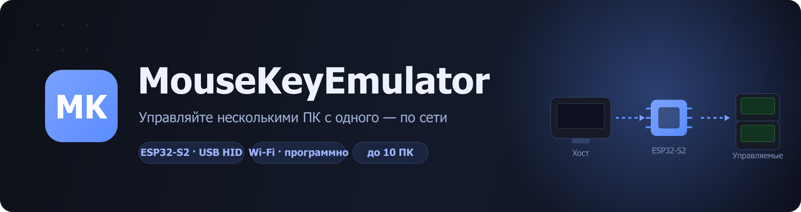
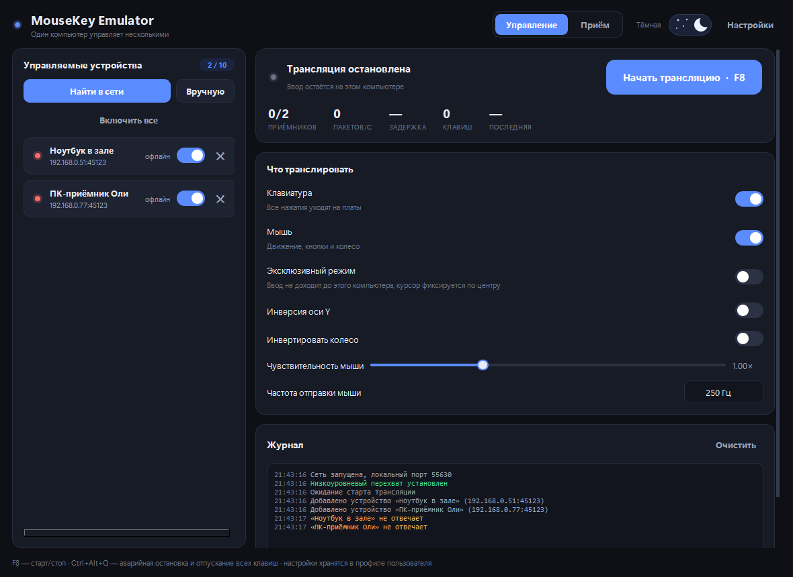
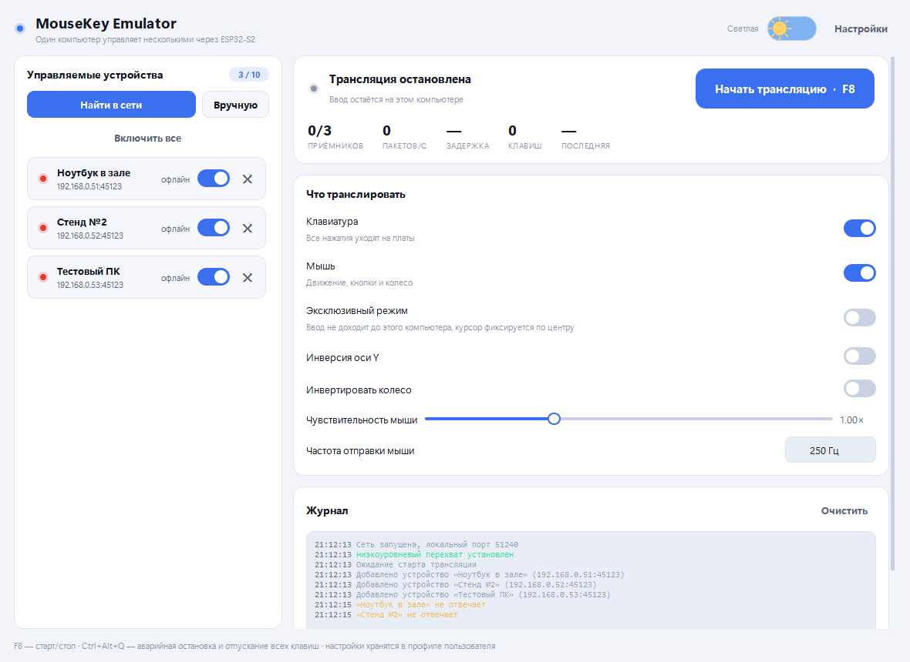
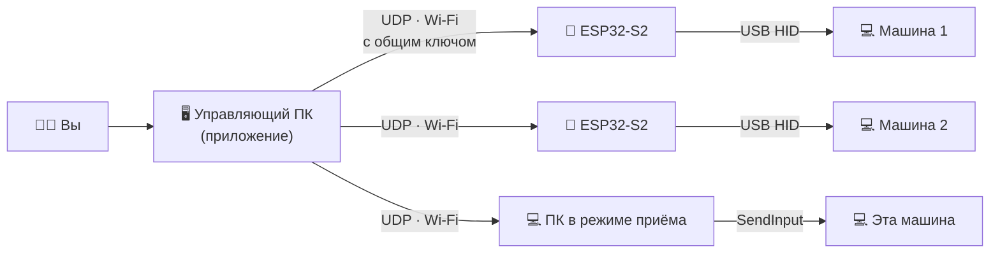
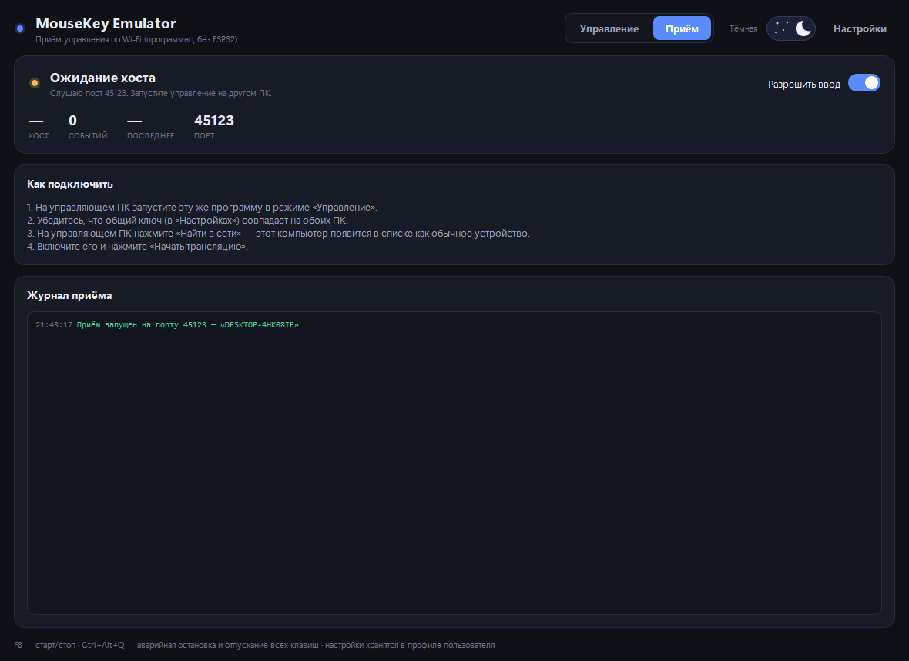
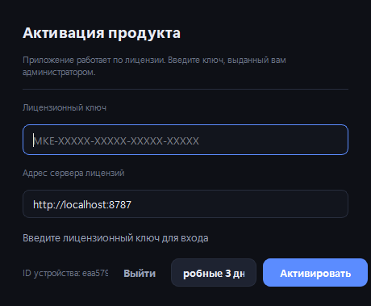

<div align="center">



<br>

**Управляйте несколькими компьютерами с одного — по-настоящему, на уровне «железа».**

Один управляющий ПК транслирует ваши нажатия клавиатуры и движения/клики мыши
на **от 1 до 10** машин одновременно.

<br>


[**⬇️ Скачать**](../../releases/latest) ·
[**🚀 Быстрый старт**](#-быстрый-старт) ·
[**🔌 Прошивка**](#2-микроконтроллер-esp32-s2) ·
[**❓ Диагностика**](#-диагностика)

</div>

---

## 📑 Содержание

- [Что это](#-что-это)
- [Скриншоты](#-скриншоты)
- [Как это устроено](#️-как-это-устроено)
- [Два режима работы](#-два-режима-работы)
- [Возможности](#-возможности)
- [Быстрый старт](#-быстрый-старт)
- [Управление и горячие клавиши](#-управление-и-горячие-клавиши)
- [Лицензирование](#-лицензирование)
- [Диагностика](#-диагностика)
- [Протокол](#-протокол)
- [Назначение и лицензии](#-назначение-и-ответственность)

---

## 🎯 Что это

**MouseKeyEmulator** — это связка из настольного приложения (управляющий ПК) и
прошивки для **ESP32-S2**. Плата вставляется в USB-порт управляемой машины и
видна ей как **обычная USB-клавиатура и мышь** — не программа, а настоящее
HID-устройство. Ваши действия на управляющем ПК мгновенно повторяются на всех
подключённых машинах.

Если платы под рукой нет — управляемый ПК можно перевести в **режим приёма**
прямо в приложении, и он будет вводить события программно, по Wi-Fi.

---

## 🖼 Скриншоты

<table>
<tr>
<td width="50%"><br><div align="center"><b>Тёмная тема</b></div></td>
<td width="50%"><br><div align="center"><b>Светлая тема</b></div></td>
</tr>
</table>

---

## ⚙️ Как это устроено



1. Ввод перехватывается на управляющем ПК **нативными хуками Windows**
   (`WH_KEYBOARD_LL` / `WH_MOUSE_LL`) и **Raw Input** — без ускорения указателя,
   движение один-в-один.
2. Пакеты идут по **UDP** (порт `45123`) и защищены общим ключом — пакеты с
   чужим ключом отбрасываются.
3. Приёмник (плата или ПК) воспроизводит их как настоящие HID-события.

---

## 🔀 Два режима работы

Переключатель **«Управление / Приём»** в шапке выбирает роль этого ПК. Оба
режима используют один протокол, поэтому плата и ПК-приёмник для хоста
взаимозаменяемы.

В шапке две вкладки: **Локально** и **Онлайн**.

| | 🔌 Локально | 📶 Онлайн |
|---|---|---|
| **Ввод (мышь/клава)** | Через плату ESP32-S2 (настоящее USB-HID) | Программно по Wi-Fi (`SendInput`) |
| **Экран** | По Wi-Fi, между двумя копиями программы | По Wi-Fi, между двумя копиями программы |
| **Оборудование** | Нужна плата ESP32 | Ничего, кроме приложения |
| **Когда выбрать** | Нужна неотличимость от «железа» | Быстро, без оборудования |

Каждая копия приложения одновременно может быть и **управляющей**, и **управляемой**: в карточке «Этот ПК» есть тумблеры «Транслировать экран» и «Принимать ввод (Онлайн)». Если на управляемом ПК запущено приложение и включена трансляция экрана — на карточке этого устройства у управляющего загорается кнопка **«Экран»** (индикатор доступности).

<div align="center"><br><sub>Режим приёма — компьютер становится «программной платой»</sub></div>

> 🖥️ **Встроенный просмотр экрана + управление из окна.** На карточке устройства
> есть кнопка «Экран» — управляющий ПК показывает рабочий стол управляемой машины
> прямо в приложении, без Parsec. В окне можно нажать **«Взять управление»**:
> открывается полный экран, ваш локальный курсор скрывается и фиксируется по
> центру, а мышь/клавиатура (относительным движением — как живая мышь) идут на
> цель; ориентируетесь по курсору в трансляции. Выход — **F8**. Экран отдаёт
> компьютер с ролью «Экран ESP» (локальный режим) или «Приём Wi-Fi». Нужен
> открытый TCP-порт **45124** на нём. (Сама ESP32-плата экран не отдаёт — в
> локальном режиме его транслирует программа на управляемом ПК.)

---

## ✨ Возможности

| | |
|---|---|
| 🎛️ **Мультиуправление** | Один ПК → до 10 машин одновременно |
| ⌨️🖱️ **Клавиатура и мышь** | Нажатия, движение 1:1, клики, колесо, 5 кнопок, медиаклавиши |
| 🔌 **Настоящее HID** | ESP32-S2 представляется реальной клавиатурой и мышью |
| 📶 **Режим без платы** | Приём по Wi-Fi другим экземпляром программы |
| ⚡ **Низкая задержка** | Нативный перехват + UDP, индикатор задержки |
| 🌗 **Тёмная и светлая темы** | С анимированным переключателем |
| 🔍 **Автопоиск** | Устройства в сети находятся сами |
| 🛎️ **Трей и горячие клавиши** | Сворачивание в трей, F8, аварийная остановка |
| 🧪 **Пробный период** | 3 дня бесплатно |

---

## 🚀 Быстрый старт

### 1. Приложение (управляющий ПК · Windows 10/11)

1. Скачайте **`MouseKeyEmulator.exe`** из [**Releases**](../../releases/latest).
2. Запустите (рекомендуется **от имени администратора** — нужно для перехвата
   и подавления ввода в эксклюзивном режиме).
3. Введите лицензионный ключ или нажмите **«Пробные 3 дня»**.

> Установка не требуется — это один самодостаточный файл.

### 2. Микроконтроллер (ESP32-S2)

<details>
<summary><b>Развернуть инструкцию по прошивке</b></summary>

<br>

Нужна плата **ESP32-S2** с нативным USB (Lolin/Wemos S2 Mini, ESP32-S2-Saola,
-S2-FN4R2, DevKitC).

1. В **Arduino IDE** установите пакет плат **esp32** (ядро 3.x). Отдельные
   библиотеки не нужны — используется встроенный USB-стек.
2. Настройки: `Board` → **LOLIN S2 Mini**, `USB CDC On Boot` → **Enabled**.
3. Откройте [`firmware/MouseKeyEmulator/MouseKeyEmulator.ino`](firmware/MouseKeyEmulator/MouseKeyEmulator.ino) и прошейте.
4. В мониторе порта (115200) задайте сеть и ключ:
   ```text
   ssid ИмяСети
   pass Пароль
   key  ваш_общий_ключ
   save
   connect
   ```

Подробности, команды консоли и маскировка USB-идентификатора — в
[`firmware/README.md`](firmware/README.md).

</details>

### 3. Соединить

Плата/приёмник и управляющий ПК — в одной сети Wi-Fi. В приложении нажмите
**«Найти в сети»**, включите найденное устройство переключателем и нажмите
**«Начать трансляцию»**.

---

## 🎮 Управление и горячие клавиши

| Действие | Клавиша |
|---|---|
| ▶️ Старт / стоп трансляции | **F8** *(настраивается)* |
| 🛑 Аварийная остановка (отпустить всё) | **Ctrl + Alt + Q** *(настраивается)* |
| 🔽 Свернуть в трей | Кнопка закрытия/сворачивания окна |

> **Эксклюзивный режим** — ввод перестаёт доходить до управляющего ПК и уходит
> только на приёмники, курсор фиксируется по центру экрана. Выход — F8 или
> аварийная клавиша.

---

## 🔐 Лицензирование

Приложение работает по лицензии, **привязанной к устройству**. При первом
запуске введите ключ от продавца — или возьмите **бесплатный пробный период на
3 дня** (один раз на компьютер). Активация выполняется онлайн один раз; далее
приложение работает и без сети, периодически перепроверяя лицензию.

<div align="center"></div>

---

## ❓ Диагностика

<details>
<summary><b>Плата не находится в сети</b></summary>

- Плата и ПК в одной сети Wi-Fi.
- Общий ключ в приложении совпадает с ключом в плате (`key ...`).
- Порт `45123/UDP` не заблокирован файрволом.
</details>

<details>
<summary><b>У устройства статус «нет USB»</b></summary>

- Плата воткнута в управляемую машину.
- В Arduino IDE выбран режим **USB-OTG (TinyUSB)**.
</details>

<details>
<summary><b>Ввод не подавляется на управляющем ПК</b></summary>

- Запустите приложение **от имени администратора**.
</details>

<details>
<summary><b>Мышь «дёргается» или слишком быстрая</b></summary>

- Уменьшите чувствительность или частоту отправки в настройках.
</details>

---

## 📡 Протокол

<details>
<summary><b>Кратко о протоколе обмена</b></summary>

<br>

UDP, порт `45123`. Заголовок 12 байт: `"MK"`, версия, тип, 32-битный токен
(FNV-1a от общего ключа), номер пакета.

| Тип | Содержимое | Назначение |
|---|---|---|
| `KEYBOARD` | 8-байтный HID-отчёт | Абсолютное состояние клавиш (самовосстановление при потере) |
| `MOUSE` | кнопки, dx, dy, колесо | Относительное движение и кнопки |
| `RELEASE_ALL` | — | Отпустить всё (аварийный стоп) |
| `CONSUMER` | usage 16 бит | Медиаклавиши |
| `PING` / `PONG` | метка + флаг USB | Keep-alive, задержка |
| `DISCOVER` / `HELLO` | имя + флаг USB | Автопоиск |

Общий ключ — это не шифрование, а отсечка чужих пакетов и защита от случайного
перекрёстного управления в одной сети.

</details>

---

## 📜 Назначение и ответственность

MouseKeyEmulator предназначен для управления **своими** компьютерами и стендами
(тестовые лаборатории, KVM-подобное управление, автоматизация, доступность).
Используйте его только на устройствах, которыми владеете или на управление
которыми у вас есть разрешение. Ответственность за использование несёт
пользователь.

## 📄 Лицензии

| Компонент | Лицензия |
|---|---|
| Прошивка (`firmware/`) | [MIT](firmware/LICENSE) |
| Приложение (`MouseKeyEmulator.exe`) | [Проприетарная / EULA](LICENSE) |

<div align="center"><br><sub>© 2026 MouseKeyEmulator · Сделано с ❤️ для управления множеством ПК</sub></div>
